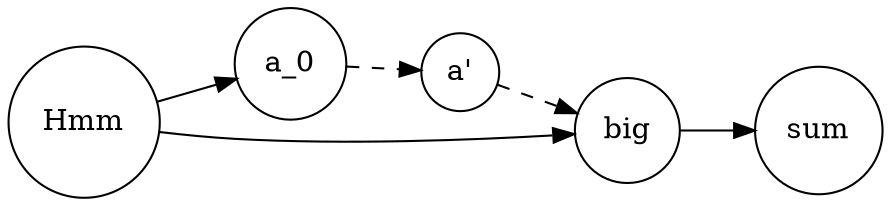

# Graphs

## `cetz`

Cetz comes with quite built-in support of drawing basic graphs.
It is much more customizable and extensible then packages like `plotst`,
so it is recommended to skim through its possibilities.

> See full manual [there](https://github.com/johannes-wolf/cetz/blob/master/manual.pdf?raw=true).

<!-- // wait till cetz:0.1.3 is published
```typ
#import "@preview/cetz:0.1.2"

#import cetz.plot
#plot.plot(size: (3,2), x-tick-step: 1, y-tick-step: 1, {
 let z(x, y) = {
   (1 - x/2 + calc.pow(x,5) + calc.pow(y,3)) * calc.exp(-(x*x) - (y*y))
 }
 plot.add-contour(x-domain: (-2, 3), y-domain: (-3, 3),
 z, z: (.1, .4, .7), fill: true)
})
```
-->

```typ
#let data = (
  [A], ([B], [C], [D]), ([E], [F])
)

#import "@preview/cetz:0.1.2": canvas, draw, tree

#canvas(length: 1cm, {
  import draw: *

  set-style(content: (padding: .2),
    fill: gray.lighten(70%),
    stroke: gray.lighten(70%))

  tree.tree(data, spread: 2.5, grow: 1.5, draw-node: (node, _) => {
    circle((), radius: .45, stroke: none)
    content((), node.content)
  }, draw-edge: (from, to, _) => {
    line((a: from, number: .6, abs: true, b: to),
         (a: to, number: .6, abs: true, b: from), mark: (end: ">"))
  }, name: "tree")

  // Draw a "custom" connection between two nodes
  let (a, b) = ("tree.0-0-1", "tree.0-1-0",)
  line((a: a, number: .6, abs: true, b: b), (a: b, number: .6, abs: true, b: a), mark: (end: ">", start: ">"))
})
```

```typ
#import "@preview/cetz:0.1.2": canvas, draw

#canvas({
    import draw: *
    circle((90deg, 3), radius: 0, name: "content")
    circle((210deg, 3), radius: 0, name: "structure")
    circle((-30deg, 3), radius: 0, name: "form")
    for (c, a) in (
    ("content", "bottom"),
    ("structure", "top-right"),
    ("form", "top-left")
    ) {
    content(c, box(c + " oriented", inset: 5pt), anchor:
    a)
    }
    stroke(gray + 1.2pt)
    line("content", "structure", "form", close: true)
    for (c, s, f, cont) in (
    (0.5, 0.1, 1, "PostScript"),
    (1, 0, 0.4, "DVI"),
    (0.5, 0.5, 1, "PDF"),
    (0, 0.25, 1, "CSS"),
    (0.5, 1, 0, "XML"),
    (0.5, 1, 0.4, "HTML"),
    (1, 0.2, 0.8, "LaTeX"),
    (1, 0.6, 0.8, "TeX"),
    (0.8, 0.8, 1, "Word"),
    (1, 0.05, 0.05, "ASCII")
    ) {
    content((bary: (content: c, structure: s, form:
    f)),cont)
    }
})
```

```typ
#import "@preview/cetz:0.1.2": canvas, chart

#let data2 = (
  ([15-24], 18.0, 20.1, 23.0, 17.0),
  ([25-29], 16.3, 17.6, 19.4, 15.3),
  ([30-34], 14.0, 15.3, 13.9, 18.7),
  ([35-44], 35.5, 26.5, 29.4, 25.8),
  ([45-54], 25.0, 20.6, 22.4, 22.0),
  ([55+],   19.9, 18.2, 19.2, 16.4),
)

#canvas({
  chart.barchart(mode: "clustered",
                 size: (9, auto),
                 label-key: 0,
                 value-key: (..range(1, 5)),
                 bar-width: .8,
                 x-tick-step: 2.5,
                 data2)
})
```

### Draw a graph in polar coords
```typ
#import "@preview/cetz:0.1.2": canvas, plot

#figure(
canvas(length: 1cm, {
  plot.plot(size: (5, 5),
    x-tick-step: 5,
    y-tick-step: 5,
    x-max: 20,
    y-max: 20,
    x-min: -20,
    y-min: -20,
    x-grid: true,
    y-grid: true,
    {
      plot.add(
        domain: (0,2*calc.pi),
        samples: 100,
        t => (13*calc.cos(t)-5*calc.cos(2*t)-2*calc.cos(3*t)-calc.cos(4*t), 16*calc.sin(t)*calc.sin(t)*calc.sin(t))
        )
    })
}), caption: "Plot made with cetz",)
```

## `diagraph`

```````typ
#import "@preview/diagraph:0.1.2": *

#set heading(numbering: (..nums) => [Graph #numbering("1", ..nums):])

#let render-example(dot, ..args) = style(styles => {
  let code = raw(dot.text, lang: "dot")
  let graph = render(dot.text, ..args)
  let side-by-side = measure(code, styles).width + measure(graph, styles).width < 20cm
  let columns = if side-by-side { (auto, auto) } else { (auto,) }
  grid(
    columns: columns,
    gutter: 1cm,
    raw(dot.text, lang: "dot"),
    render(dot.text, ..args),
  )
})

= Test

#render-example(
  ```
  digraph {
    rankdir=LR;
    f -> B
    B -> f
    C -> D
    D -> B
    E -> F
    f -> E
    B -> F
  }
  ```
)


= Eating

#render-example(
  ```
  digraph {
    orange -> fruit
    apple -> fruit
    fruit -> food
    carrot -> vegetable
    vegetable -> food
    food -> eat
    eat -> survive
  }
  ```
)


= FFT

Labels are overridden manually.

#render-example(
  ```
  digraph {
    node [shape=none]
    1
    2
    3
    r1
    r2
    r3
    1->2
    1->3
    2->r1 [color=red]
    3->r2 [color=red]
    r1->r3 [color=red]
    r2->r3 [color=red]
  }
  ```
)


= State Machine

#render-example(
  ```
  digraph finite_state_machine {
    rankdir=LR
    size="8,5"

    node [shape=doublecircle]
    LR_0
    LR_3
    LR_4
    LR_8

    node [shape=circle]
    LR_0 -> LR_2 [label="SS(B)"]
    LR_0 -> LR_1 [label="SS(S)"]
    LR_1 -> LR_3 [label="S($end)"]
    LR_2 -> LR_6 [label="SS(b)"]
    LR_2 -> LR_5 [label="SS(a)"]
    LR_2 -> LR_4 [label="S(A)"]
    LR_5 -> LR_7 [label="S(b)"]
    LR_5 -> LR_5 [label="S(a)"]
    LR_6 -> LR_6 [label="S(b)"]
    LR_6 -> LR_5 [label="S(a)"]
    LR_7 -> LR_8 [label="S(b)"]
    LR_7 -> LR_5 [label="S(a)"]
    LR_8 -> LR_6 [label="S(b)"]
    LR_8 -> LR_5 [label="S(a)"]
  }
  ```
)


= Clustering

See http://www.graphviz.org/content/cluster.

#render-example(
  ```
  digraph G {

    subgraph cluster_0 {
      style=filled;
      color=lightgrey;
      node [style=filled,color=white];
      a0 -> a1 -> a2 -> a3;
      label = "process #1";
    }

    subgraph cluster_1 {
      node [style=filled];
      b0 -> b1 -> b2 -> b3;
      label = "process #2";
      color=blue
    }

    start -> a0;
    start -> b0;
    a1 -> b3;
    b2 -> a3;
    a3 -> a0;
    a3 -> end;
    b3 -> end;

    start [shape=Mdiamond];
    end [shape=Msquare];
  }
  ```
)


= HTML

#render-example(
  ```
  digraph structs {
      node [shape=plaintext]
      struct1 [label=<
  <TABLE BORDER="0" CELLBORDER="1" CELLSPACING="0">
    <TR><TD>left</TD><TD PORT="f1">mid dle</TD><TD PORT="f2">right</TD></TR>
  </TABLE>>];
      struct2 [label=<
  <TABLE BORDER="0" CELLBORDER="1" CELLSPACING="0">
    <TR><TD PORT="f0">one</TD><TD>two</TD></TR>
  </TABLE>>];
      struct3 [label=<
  <TABLE BORDER="0" CELLBORDER="1" CELLSPACING="0" CELLPADDING="4">
    <TR>
      <TD ROWSPAN="3">hello<BR/>world</TD>
      <TD COLSPAN="3">b</TD>
      <TD ROWSPAN="3">g</TD>
      <TD ROWSPAN="3">h</TD>
    </TR>
    <TR>
      <TD>c</TD><TD PORT="here">d</TD><TD>e</TD>
    </TR>
    <TR>
      <TD COLSPAN="3">f</TD>
    </TR>
  </TABLE>>];
      struct1:f1 -> struct2:f0;
      struct1:f2 -> struct3:here;
  }
  ```
)


= Overridden labels

Labels for nodes `big` and `sum` are overridden.



#raw-render(
  ```
  digraph {
    rankdir=LR
    node[shape=circle]
    Hmm -> a_0
    Hmm -> big
    a_0 -> "a'" -> big [style="dashed"]
    big -> sum
  }
  ```
)
```````

## `bob-draw`

Draw easily with ASCII, WASM plugin for [svgbob](https://github.com/ivanceras/svgbob).

`````typ
#import "@preview/bob-draw:0.1.0": *
#render(```
         /\_/\
bob ->  ( o.o )
         \ " /
  .------/  /
 (        | |
  `====== o o
```)
`````

`````typ
#import "@preview/bob-draw:0.1.0": *
#show raw.where(lang: "bob"): it => render(it)

#render(
    ```
      0       3  
       *-------* 
    1 /|    2 /| 
     *-+-----* | 
     | |4    | |7
     | *-----|-*
     |/      |/
     *-------*
    5       6
    ```,
    width: 25%,
)

```bob
"cats:"
 /\_/\  /\_/\  /\_/\  /\_/\ 
( o.o )( o.o )( o.o )( o.o )
```

```bob
       +10-15V           ___0,047R
      *---------o-----o-|___|-o--o---------o----o-------.
    + |         |     |       |  |         |    |       |
    -===-      _|_    |       | .+.        |    |       |
    -===-      .-.    |       | | | 2k2    |    |       |
    -===-    470| +   |       | | |        |    |      _|_
    - |       uF|     '--.    | '+'       .+.   |      \ / LED
      +---------o        |6   |7 |8    1k | |   |      -+-
             ___|___   .-+----+--+--.     | |   |       |
              -═══-    |            |     '+'   |       |
                -      |            |1     |  |/  BC    |
               GND     |            +------o--+   547   |
                       |            |      |  |`>       |
                       |            |     ,+.   |       |
               .-------+            | 220R| |   o----||-+  IRF9Z34
               |       |            |     | |   |    |+->
               |       |  MC34063   |     `+'   |    ||-+
               |       |            |      |    |       |  BYV29     -12V6
               |       |            |      '----'       o--|<-o----o--X OUT
 6000 micro  - | +     |            |2                  |     |    |
 Farad, 40V ___|_____  |            |--o                C|    |    |
 Capacitor  ~ ~ ~ ~ ~  |            | GND         30uH  C|    |   --- 470
               |       |            |3      1nF         C|    |   ###  uF
               |       |            |-------||--.       |     |    | +
               |       '-----+----+-'           |      GND    |   GND
               |            5|   4|             |             |
               |             |    '-------------o-------------o
               |             |                           ___  |
               `-------------*------/\/\/------------o--|___|-'
                                     2k              |       1k0
                                                    .+.
                                                    | | 5k6 + 3k3
                                                    | | in Serie
                                                    '+'
                                                     |
                                                    GND
```
`````

## `wavy`

## `finite`

Finite automata. See the
[manual](https://github.com/jneug/typst-finite/blob/main/manual.pdf) for a full
documentation.

```typ
#import "@preview/finite:0.3.0": automaton

#automaton((
  q0: (q1:0, q0:"0,1"),
  q1: (q0:(0,1), q2:"0"),
  q2: (),
))
```
